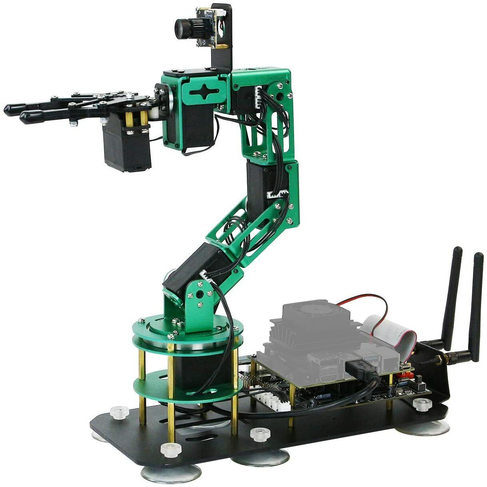

# Green Manipulator Project

## Overview

This project will have you working with the Green Yahboom Manipulator.

The project is broken down into a few key phases. Some phases can be done in any order, but the final stage will rely on the work from all the previous ones. The final goal with this project will be to be able to recognize an object through a camera feed, and then pick up that object and move it with the manipulator.

## Phases

### Object Detection

The first phase of this project will be learning about object detection computer vision algorithms. After this section, you should be able to recognize and mark an object through a camera feed.

More info on this phase can be found in [Object Detection](object_detection/README.md).

### Robot Control

The second phase of this project will be learning to control and use the robot. There is a great SDK with a few tutorials to follow along with. Additionally, some time can be spent learning about Forward and Inverse Kinematics, which can be used to localise the robot's end effector position, as well as calculating the angles required to reach a particular point.

More info on this phase can be found in [Robot Control](robot_control/README.md).

### Combination

The final phase of the project will be about combining the object detection and vision algorithms that were learned and used in part one, with the control and manipulation of the robot in part two. This section, you will teach the robot to recognize a certain object, and then pick up and move that same object with the robot.

More info on this phase can be found in [Final Phase](final_phase/README.md).